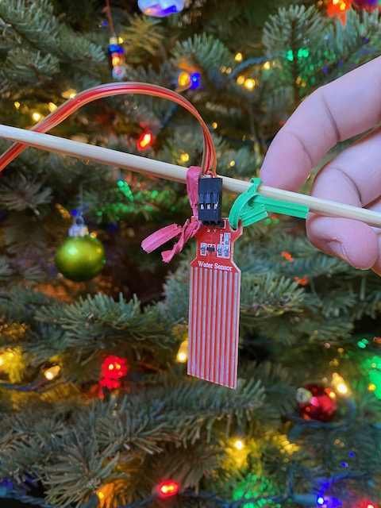

# waterSensor

This little project automatically waters your Christmas tree for you.  We got tired having to crawl under the tree to water it without overflowing, so I built a little project that senses the water level for you, and pumps the water from a much more convenient tank of water on the side of the tree.

## Sensor

To detect the water level, I used one of these depth sensors.  +/- are VCC and ground, and `S` is the output level, in analog (10 bits, so 1024 max).

I ordered 10 of these, and all 10 are very different from each other.  So I put placeholders in the code to read the Low and High settings from the exact sensor you're using.  

## Pump

For a simple pump, I bought a [kit](https://smile.amazon.com/gp/product/B07TMVNTDK) that's normally used for watering plants.  This kit includes submersible pumps, tubing, and relays to switch the pump on and off.  

Hooking this up is straightforward.  You connect an output pin from the Arduino into the "IN1" input pin of the relay board.  Then the pump itself hooks up to the NC (normally closed) output of the relay and the 5V line of the Arduino.  You can't just hook up the pump to the Arduino output pin directly, because the current on those Arduino pins is limited to 20mA.  That's why we have a relay switch in this circuit.  The 5V rail line can supply much more current - enough to drive the pump at least, so I didn't need to use an alternative power source for the pump.

## Microcontroller

I chose the [Arduino Nano Every](https://store.arduino.cc/usa/nano-every), mostly because it's small and cheap.  I find it a little more difficult to use than the Nano 33 line, but it's still passable.  The libraries are a bit more finicky (for example, the default LCD library would not compile for it) and the LED is only on/off, not RGB.  For a simple project like this, it's just fine since all you need for this project is 2 GPIO pins - 1 input for the depth sensor, and 1 output for the pump control.  I'm sure there are even cheaper options out there.

## Code

There are tons of ways you could write the code, as it's very simple.  I chose to turn on the pump when the water level dropped to below the midpoint between Low and High, but that's completely arbitrary - you could choose to turn on water any time it's below the Low point, or the High point, or whatever.  I would go by how you place the sensor in the base of the tree.

To minimize power usage, I put the microcontroller to sleep for 10 seconds if everything is fine, then have it refresh more frequently while the pump is on.

## Bill of Materials

| Part | Cost Total | Cost each |
| ---- | ---------- | --------- |
| [Arduino Nano Every](https://smile.amazon.com/gp/product/B07YQ56B6Q) | $33.00 for 3 | $11.00 |
| [Water Level Sensor](https://smile.amazon.com/gp/product/B07THDH7Y4) | $6.19 for 10 | $0.62 |
| [Pump, Relays, Tubing](https://smile.amazon.com/gp/product/B07TMVNTDK) | $28.99 for 4 | $7.25 | 
| Total | $68.18 | $18.87 | 

So the total cost per unit is $18.87.  That's a bit higher than I expected.  It looks like a cost reduced version of the Nano Every can be had for about $5 in bulk, so that would save $6, but I like to support Arduino so I buy the name brand ones.  You might even have extra ones sitting around from previous projects (like I do now since I bought three).  

The pump and relays could also likely be had for cheaper, but I intend to reuse the parts for a plant watering system after Christmas, so I opted for the bigger 4-way set even though I'm only using one relay and pump.

## Result

The final circuit got plugged into the wall outlet to drive via the microusb port at 5V.  I put the whole setup on a stool next to the tree to keep it elevated above the tree's waterline.  That way, the water doesn't get siphoned back out when the pump stops.  The relay light turns on and red when it's off, but turns off when the pump is going, so you get a visual signal of what the circuit is trying to do.  Here's an ugly photo of the setup next to the tree.

Under the tree, I used a chopstick to hang the depth sensor in the water, and attached the water line to it as well.  It's hard to get a good picture of it, so here's a bad picture.

Now when we water the tree, instead of crouching under the tree to try to peak at the water line, while pouring water from a watering can awkwardly, doing our best spiderman impression, we can just plug in the circuit, and refill the bowl on the side easily.  In theory, I could just leave this plugged in all the time, but for that, I'd probably want a depth sensor in the source bowl too so the pump turns off when the source bowl is low.  Otherwise the pumps could just go forever. Maybe I'll add that next.

Good luck!  Let me know if you have any tips on improvements.
